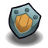
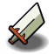

# Shootem-up

## Présentation
Ce jeu a été développé par **DJEBLOUN Yacine** et **RODDIER Corentin** dans le cadre d'un projet informatique donné dans l'enseignement **Programmation en C**. Ce jeu n'a pas été fait dans un but commercial et peut contenir des images non libres de droits.

## Compilation
Pour compiler le jeu : `make`

Pour lancer le jeu : `make run`

## Logs github
Pour générer les logs github : `git log --pretty=format:"%cs (%an): %s" >> logs.txt`

## Documentation Doxygen
Pour générer la documentation : ``doxygen Doxygen``

## Utilisation
### Menu principal
En lancant le jeu, vous arriverez sur une page ressemblant à celle-ci :

> Ecran du menu principal

Vous avez le choix entre 3 options :
- Jouer : vous permet de lancer une partie de Shootem-up
- Crédits : vous permet de voir les crédits du jeu
- Quitter : vous permet de quitter le jeu

### En jeu
Une fois la partie lancée, vous arriverez sur une page ressemblant à celle-ci :

> Ecran de jeu

Une fois sur cet écran, le jeu est lancé et vous pouvez vous déplacer avec les touches directionnelles de votre clavier. Vous avez également la possibilité de tirer des projectiles avec la touche `espace` sur les ennemis qui vont arriver vers vous. Plus votre score augmente, plus le jeu devient difficile : les ennemis sont plus nombreux et ont plus de points de vie. Tous les 500 points, un bonus ou un malus apparait. Vous pouvez les récupérer en vous déplaçant dessus.
Les bonus suivants vous permettent de : 
 : regagner 1 point de vie 
 : protéger de 3 projectiles ennemis 
 : augmenter votre vitesse de 2 points 
 : tuer l'ensemble des ennemis présents sur la page 
 : améliorer d'un point les dégâts de vos projectiles  
Les malus suivants vous infligent :  
 : un inversement des touches directionnelles  
 : une perte de 5 points de vitesse (limité à 5 de vitesse minimum) 
 : à vous de le découvrir... 